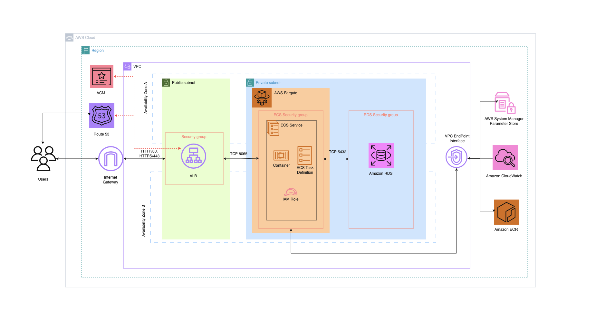
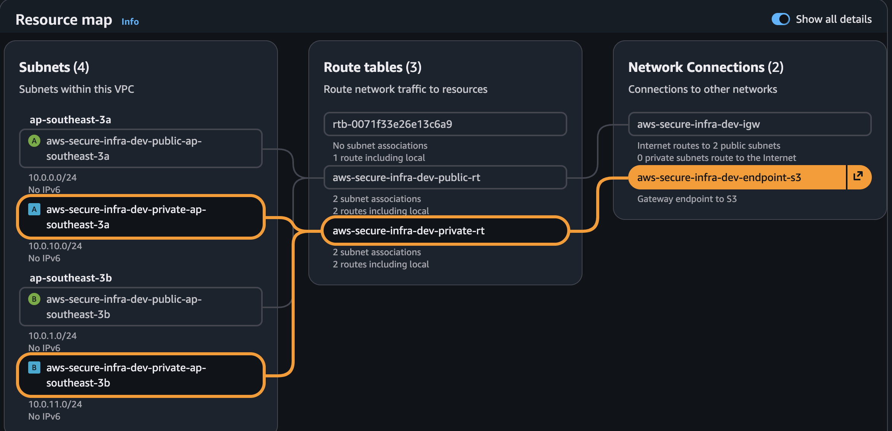
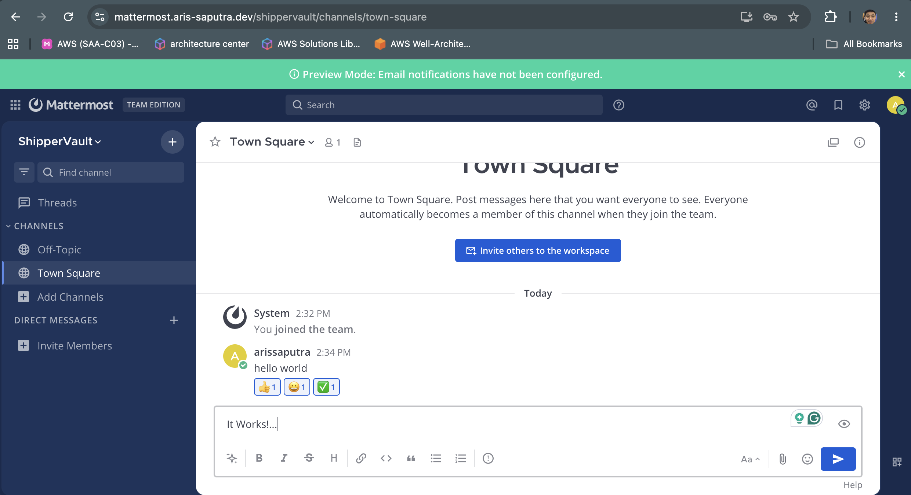
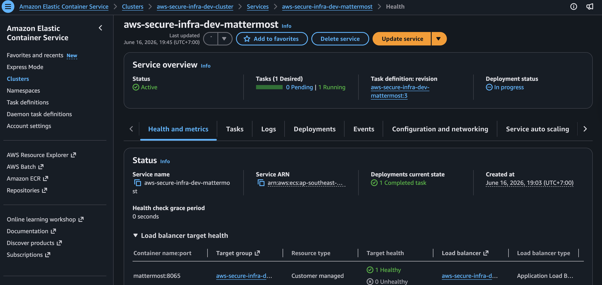
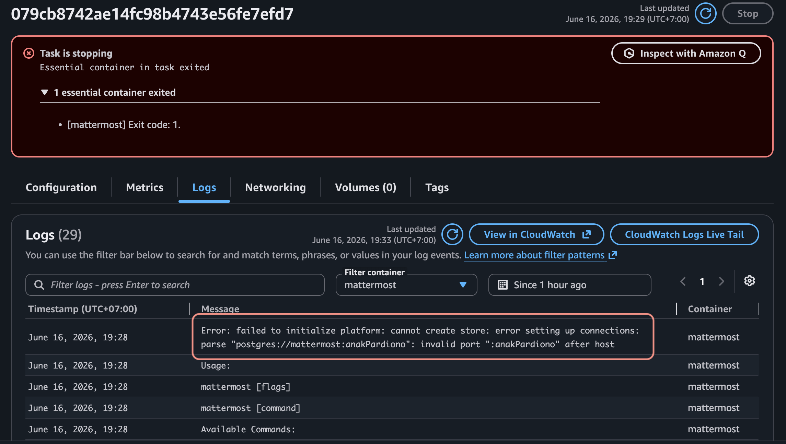
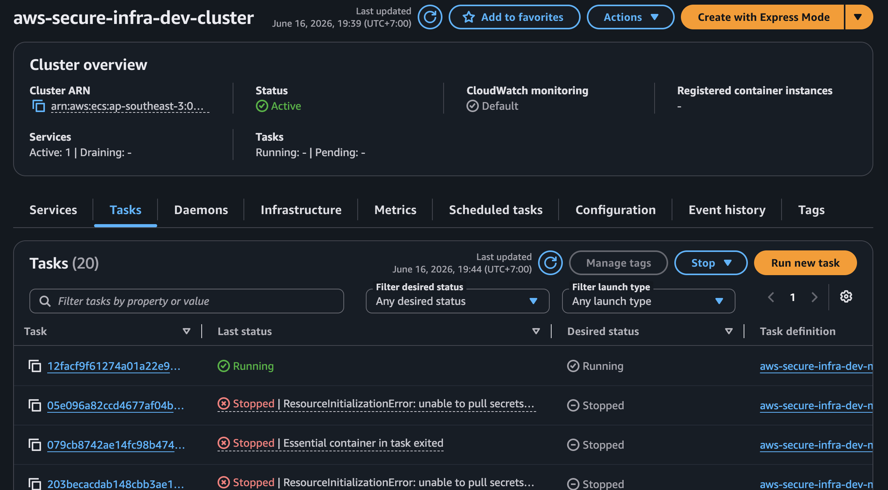
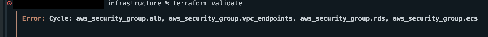
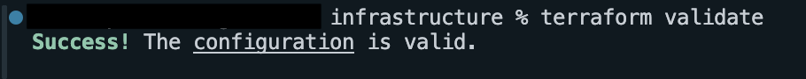

# AWS Secure Infrastructure

A production-like AWS deployment of Mattermost on ECS Fargate, built with Terraform and native AWS tooling. This is my primary portfolio project for transitioning into cloud support / junior cloud-DevOps roles, with cloud security as the long-term goal.

**What this demonstrates:** a private-subnet-only compute and data tier with no direct internet exposure, NAT-free networking via VPC endpoints (cost-optimized without sacrificing isolation), and secrets injected into the container at runtime rather than baked into images or stored as plaintext environment variables.

The project is split into three phases:

- **Phase 1 — Core Infrastructure** (`completed`)
- **Phase 2 — AWS Well-Architected 6 Pillars** (`In Proggress`)
- **Phase 3 — Infrastructure Automation** (`Planned`)

**Status:** Phase 1 of 3 completed | `dev` environment | deploy-and-destroy lab model

---

## Architecture Diagram



---

## Infrastructure Overview

Built using modular, reusable Terraform so the same code can deploy multiple environments without rewriting it, while keeping infrastructure, tagging, and configuration consistent.

### 1. Networking

**VPC**

- IPv4 CIDR block: `10.0.0.0/16` (default)
- Region: Asia Pacific — Jakarta (default)
- Availability Zones: 2 AZs, dynamically selected via `slice()` based on the region's available AZs
- Internet Gateway attached
- DNS hostnames and DNS support enabled
- Tagged by environment and project name

**Subnet layout & tiering**

The VPC is segmented into a 3-tier subnet design across 2 AZs:

- Public subnets — internet-facing (ALB only)
- Private subnets — application layer (ECS Fargate)
- Private subnets — database layer (RDS)

Each subnet's CIDR block is generated automatically from the VPC CIDR using `cidrsubnet()`.

**VPC Endpoints**

Instead of a NAT Gateway, VPC Interface Endpoints handle private connectivity for ECR, S3, SSM, and CloudWatch Logs.

**Routing & traffic flow**

Public subnets route to the Internet Gateway. Private subnets have no direct internet route — outbound traffic to AWS services goes through VPC Endpoints instead.

**Security groups — network segmentation**

| Name               | Inbound                           | Outbound              |
| ------------------ | --------------------------------- | --------------------- |
| `alb-sg`           | `0.0.0.0/0` on HTTP/80, HTTPS/443 | `ecs-sg` on TCP/8065  |
| `ecs-sg`           | `alb-sg` on TCP/8065              | `rds-sg` on TCP/5432, |
| `rds-sg`           | `ecs-sg` on TCP/5432              | None                  |
| `vpc-endpoints-sg` | `ecs-sg` on HTTPS/443             | none                  |


_Figure 1: Console view of VPC resource map_

### 2. Route 53

DNS management for the application domain via a hosted zone, which holds records for:

- TLS certificate validation
- Application domain and subdomains
- Alias record pointing to the ALB


_Figure 2: mattermost.aris-saputra.dev_

### 3. Application Load Balancer + TLS (ALB + ACM)

The ALB is deployed in the public subnets and integrated with an ACM certificate for TLS termination.

- HTTP/80 listener redirects to HTTPS/443; HTTPS/443 listener forwards to the target group.
- Target group points to the ECS service on port 8065, with health checks over HTTP against `/api/v4/system/ping`.

### 4. Compute (ECS Fargate)

The application runs as a Docker container in an ECS cluster using the Fargate launch type. Tasks run in private subnets with no public IP, and the security group only allows inbound traffic from `alb-sg` on port 8065.

Task definition configuration:

- `network_mode = "awsvpc"`
- `cpu = "256"`, `memory = "512"`
- Execution role policy: `sts:AssumeRole`, `ssm:GetParameters`, `AmazonECSTaskExecutionRolePolicy`
- Task role policy: `sts:AssumeRole`, `ssm:GetParameters`
- Container definition (via `jsonencode`): pulls the image from ECR and ships logs to CloudWatch, both over VPC Endpoints


_Figure 3: ECS Service health_

### 5. Database (RDS PostgreSQL)

RDS is deployed in the database-tier private subnets, with a security group that only allows traffic from `ecs-sg` on port 5432.

Configuration:

- PostgreSQL 16.9
- `t3.micro` instance class
- 20 GB `gp2` allocated storage
- Credentials via SSM (not stored in Terraform)
- Single-AZ
- Storage encryption enabled - AWS-managed key

### 6. Secrets Handling

Database credentials are managed via SSM Parameter Store, not Terraform variables:

- The DB password is stored manually as a `SecureString` in SSM at `/${var.environment}/${var.project_name}/database/mattermost/password`.
- A `locals` block in `ssm.tf` constructs the full Postgres DSN (with `sslmode=require`) and writes it to a second SSM parameter: `/${var.environment}/${var.project_name}/database/mattermost/db_dsn`.
- The ECS task definition references the DSN parameter ARN via the `secrets` block (`valueFrom`), so it's injected at container start rather than stored in plaintext environment variables.
- `MM_SERVICESETTINGS_SITEURL` stays in the `environment` block since it's non-sensitive.
- The ECS task execution role has `ssm:GetParameters` scoped to the DSN parameter ARN.

**Known limitation:** because Terraform writes the DSN to SSM, it also ends up in `.tfstate` in plaintext. For a local-state lab setup that's an accepted tradeoff, but it's called out here rather than glossed over. A real production setup would need a remote backend with encryption and tightly scoped access controls — or a different approach that avoids passing the DSN through Terraform entirely (e.g. constructing it at runtime inside the container, or using Secrets Manager's dynamic reference syntax).

---

## Infrastructure Code Layout

```
aws-secure-infrastructure/
├── README.md
├── .gitignore
├── assets/
├── infrastructure/
│   ├── providers.tf
│   ├── versions.tf
│   ├── variables.tf
│   ├── terraform.tfvars.example
│   ├── outputs.tf
│   ├── networking.tf
│   ├── security.tf
│   ├── iam.tf
│   ├── alb.tf
│   ├── ecs.tf
│   ├── ssm.tf
│   ├── rds.tf
│   ├── acm.tf
│   └── dns.tf
```

---

## Tech Stack

| Service                     | Purpose                          | Why this over the alternative                                                                |
| --------------------------- | -------------------------------- | -------------------------------------------------------------------------------------------- |
| Terraform                   | Infrastructure as Code           | Reproducible, version-controlled infrastructure; destroy and redeploy in minutes             |
| ECS Fargate                 | Run the Mattermost container     | No cluster management vs. EKS; cheaper and simpler for a single-app deployment               |
| RDS PostgreSQL (`t3.micro`) | Backend datastore                | Free-tier eligible; Aurora Serverless v2 is not                                              |
| ALB                         | Load balancing + TLS termination | Native integration with ACM and ECS                                                          |
| ACM                         | TLS certificate                  | Free, auto-renewing, integrates directly with ALB                                            |
| Route 53                    | DNS management                   | Native integration with ALB; handles domain delegation                                       |
| SSM Parameter Store         | Secrets management               | `SecureString` is free on the standard tier; planned migration to Secrets Manager in Phase 2 |
| VPC Interface Endpoints     | Private AWS service access       | Removes NAT Gateway cost (~$32/month) for ECR, S3, SSM, CloudWatch Logs                      |

---

## Key Technical & FinOps Decisions

- **ECS Fargate over EKS** — Kubernetes is overkill for running a single app at this stage; not worth the added operational complexity.
- **RDS over Aurora Serverless v2** — Aurora Serverless v2 isn't free-tier eligible. RDS `t3.micro` is.
- **VPC Interface Endpoints over a NAT Gateway** — a NAT Gateway runs ~$32/month minimum, which doesn't make sense for a lab setup. Endpoints cover ECR, S3, SSM, and CloudWatch Logs for less. Tradeoff: anything needing general internet access from private subnets (e.g. pulling images straight from Docker Hub) won't work — addressed by routing all image pulls through ECR.
- **Modular Terraform files over one monolithic file** — easier to navigate and mirrors how the actual infrastructure is organized.
- **Single-AZ RDS for Phase 1** — Multi-AZ doubles RDS cost with no real benefit in a lab environment.
- **Native AWS tools only** — Phase 2 (Well-Architected pillars) uses GuardDuty, Security Hub, Config, CloudWatch, Backup, IAM Access Analyzer, and similar. No third-party agents or SIEMs (e.g. Wazuh).
- **Deploy and destroy** — the stack is spun up only while actively in use and torn down afterward to avoid idle cost.

---

## How to Deploy

### 1. Prerequisites

AWS CLI installed and authenticated (`aws configure`). `tfenv` installed:

```bash
brew install tfenv
tfenv install 1.15.5
tfenv use 1.15.5
```

### 2. Setup

```bash
git clone https://github.com/ArisSaputraMd/aws-secure-infrastructure.git
cd aws-secure-infrastructure/infrastructure
cp terraform.tfvars.example terraform.tfvars
```

Edit `terraform.tfvars` with your local parameters (this file is gitignored).

Before applying, manually create the DB password parameter in SSM as a `SecureString` (see Secrets Handling above).

### 3. Apply

```bash
terraform init
terraform plan -out=tfplan
terraform apply tfplan
```

### 4. Tear-Down

```bash
terraform destroy -auto-approve
```

---

## Roadmap

- [x] **Phase 1 — Core Infrastructure** — VPC, subnets, route tables, VPC endpoints, security groups, IAM, ECS Fargate, RDS. Infrastructure built and validated (`terraform plan` clean, ECS task starts and connects to RDS).
- [ ] **Phase 2 — AWS Well-Architected 6 Pillars** (native AWS tools only) — Operational Excellence, Security, Reliability, Performance Efficiency, Cost Optimization, Sustainability.
- [ ] **Phase 3 — Infrastructure Automation** — Terraform modules, CI/CD via GitHub Actions, automated validation.

---

## What I Learned

This section documents real issues hit during deployment and how they were debugged — not a clean retelling, the actual troubleshooting path.

### 1. ECS Task Role vs. ECS Task Execution Role

**Initial assumption:** Attaching `ssm:GetParameters` to the ECS Task Role would be enough to retrieve credentials from SSM, the same way an application reaches S3 or DynamoDB.

That assumption was wrong for this case. The task definition uses the `secrets` block:

```hcl
secrets = [
  {
    name      = "MM_SQLSETTINGS_DATASOURCE"
    valueFrom = aws_ssm_parameter.db_password.arn
  }
]
```

When the `secrets` block is used, ECS retrieves the parameter _before_ the container starts — the request comes from the ECS infrastructure itself, not from code running inside the container. As a result, the task failed repeatedly during provisioning, and CloudWatch logs showed permission errors.


_Figure 4: Task failing during provisioning due to missing SSM permission_

The fix: move `ssm:GetParameters` to the ECS Task Execution Role instead of the Task Role.


_Figure 5: Execution role after adding the SSM permission_

**Key insight**

- **Task Execution Role** — used by ECS infrastructure for actions like pulling images from ECR, retrieving secrets from SSM/Secrets Manager, and shipping logs to CloudWatch.
- **Task Role** — used by the application _inside_ the running container to call AWS services (S3, DynamoDB, SQS, SSM) via SDK/API.

**Takeaway:** if ECS needs the permission before the container starts, it goes on the Task Execution Role. If the application needs it after the container starts, it goes on the Task Role.

### 2. Reserved characters in connection strings (URI encoding)

After fixing the IAM issue, the container started but exited immediately with `EssentialContainerExited`, [mattermost] exit code 1.


_Figure 6: ECS console errors showing the exit error_

**Root cause:** The PostgreSQL DSN couldn't be parsed correctly. The database password contained `#`, a reserved URI character that marks the start of a URI fragment — so part of the password was interpreted as URI syntax instead of credential data. Terraform generated the string correctly, but the resulting connection URI was invalid because reserved characters in the password weren't URL-encoded.

**Fix:** Wrap the password with `urlencode()` inside `local.db_dsn`.

```hcl
locals {
  db_dsn = "postgres://${var.db_username}:${urlencode(data.aws_ssm_parameter.db_password.value)}@${aws_db_instance.primary.address}:5432/${var.db_name}?sslmode=require"
}
```

This properly escapes `#` and any other reserved URI characters.


_Figure 7: Task running successfully after the encoding fix_

**Debugging path that worked:**
ECS console errors (ENI / log stream) → `describe-tasks` for `stoppedReason` → CloudWatch logs for the actual application error.

> Each layer (IAM, then Application) had to be peeled back in order; fixing one revealed the next.

## 3. Security Group Dependency Cycles in Terraform

While implementing least-privilege security group rules, I encountered a Terraform dependency cycle.

**Security groups — network segmentation**

| Name               | Inbound                           | Outbound             |
| ------------------ | --------------------------------- | -------------------- |
| `alb-sg`           | `0.0.0.0/0` on HTTP/80, HTTPS/443 | `ecs-sg` on TCP/8065 |
| `ecs-sg`           | `alb-sg` on TCP/8065              | `rds-sg` on TCP/5432 |
| `rds-sg`           | `ecs-sg` on TCP/5432              | None                 |
| `vpc-endpoints-sg` | `ecs-sg` on HTTPS/443             | None                 |


_Figure 8: Console view of terraform cycle error_

**Root cause:** SG rules are declared inline inside the `aws_security_group` resource, each rule that references another SG by ID becomes a dependency of that resource.

- ALB's inline egress block referencing `ecs.id` makes ALB depend on ECS.
- ECS's inline ingress block referencing `alb.id` makes ecs depend on ALB.

Terraform builds a dependency graph before applying - A depending on B while B depends on A isn't a valid DAG, so the graph walker errors before either resource is created.

**Fix:** Pulling rules out into standalone `aws_vpc_security_group_ingress_rule` / `aws_vpc_security_group_egress_rule` resources breaks this:

- The bare `aws_security_group` resources no longer reference each other, so both get created first with no inline rules.
- The rule resources, created afterward, are what hold the cross-references and a rule depending on two already-existing SGs isn't a cycle, it's just two leaf nodes.

> Note: Standalone security group rule resources require AWS Provider v5.x or later.

```hcl
#e.g.
resource "aws_security_group" "ecs" {     #Security group resource
...
}

resource "aws_vpc_security_group_egress_rule" "ecs_to_vpc_endpoint" {     #Security group egress rule
  security_group_id        = aws_security_group.ecs.id
  from_port                = 443
  ...
  referenced_security_group_id = aws_security_group.vpc_endpoints.id
}
```


_Figure 9: Console view of valid configuration_

**Key insight:**

- Allways run `terraform validate` command after add/changging code
- AWS allows bidirectional SG references, but Terraform needs an acyclic dependency graph.
  > The same ARN-cycle pattern can appear with other resources (e.g. CloudTrail + S3 bucket policy) — if the ARN is predictable, construct it as a local value to break the dependency

**Terraform Troubleshoting runbook:**

language/state/core/provider → research → thesis → test → validate → apply/rollback → document.

> _There are four potential types of issues that you could experience with Terraform: language, state, core, and provider errors_

Read more about terraform troubleshooting guidance [here](https://developer.hashicorp.com/terraform/tutorials/configuration-language/troubleshooting-workflow)

---

## License

Distributed under the MIT License. See `LICENSE` for details.
