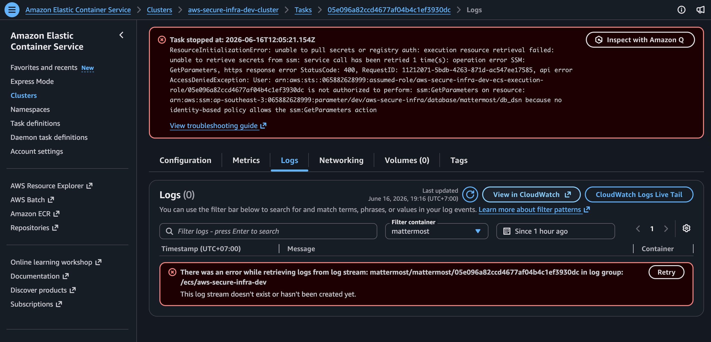
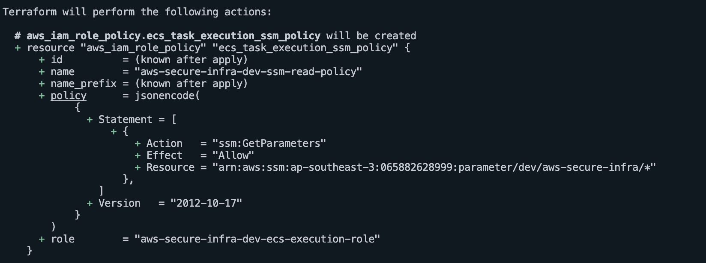

# Lesson 1 — ECS Task Role vs. Task Execution Role

## Initial Assumption

Attaching `ssm:GetParameters` to the ECS Task Role would be enough to retrieve credentials from SSM — the same way an application reaches S3 or DynamoDB at runtime.

## What Went Wrong

That assumption was wrong for this case. The task definition uses the `secrets` block:

```hcl
secrets = [
  {
    name      = "MM_SQLSETTINGS_DATASOURCE"
    valueFrom = aws_ssm_parameter.db_dsn.arn
  }
]
```

When the `secrets` block is used, ECS retrieves the parameter _before_ the container starts — the request comes from the ECS infrastructure itself, not from code running inside the container. The task failed repeatedly during provisioning with permission errors because the wrong role had the policy.


_Figure 1: Task failing during provisioning due to missing SSM permission_

## Debugging Path

```
ECS console → task stoppedReason
→ CloudWatch log stream → AccessDeniedException on ssm:GetParameters
→ identified the permission was on the Task Role, not the Task Execution Role
```

## Fix

Move `ssm:GetParameters` to the **ECS Task Execution Role**, scoped to the DSN parameter ARN:

```hcl
resource "aws_iam_role_policy" "ecs_execution_ssm" {
  name = "ssm-get-db-dsn"
  role = aws_iam_role.ecs_task_execution.id

  policy = jsonencode({
    Version = "2012-10-17"
    Statement = [
      {
        Effect   = "Allow"
        Action   = ["ssm:GetParameters"]
        Resource = [aws_ssm_parameter.db_dsn.arn]
      }
    ]
  })
}
```


_Figure 2: Execution role after adding the SSM permission_

## Key Insight

| Role                | Used by                          | When                                                                                                                        |
| ------------------- | -------------------------------- | --------------------------------------------------------------------------------------------------------------------------- |
| Task Execution Role | ECS infrastructure               | Before container starts — pulling images from ECR, retrieving secrets from SSM/Secrets Manager, shipping logs to CloudWatch |
| Task Role           | Application inside the container | After container starts — calling AWS services via SDK/API (S3, DynamoDB, SQS, SSM)                                          |

If ECS needs the permission before the container starts, it goes on the Task Execution Role. If the application needs it after the container starts, it goes on the Task Role.
