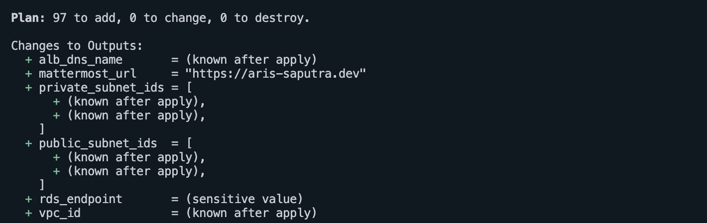
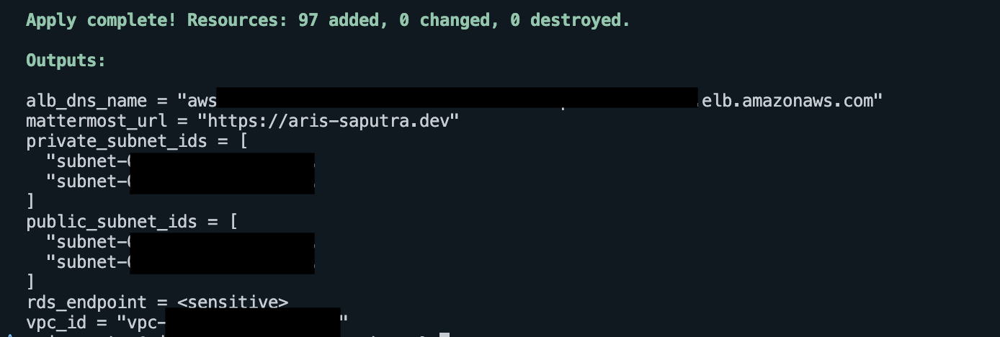
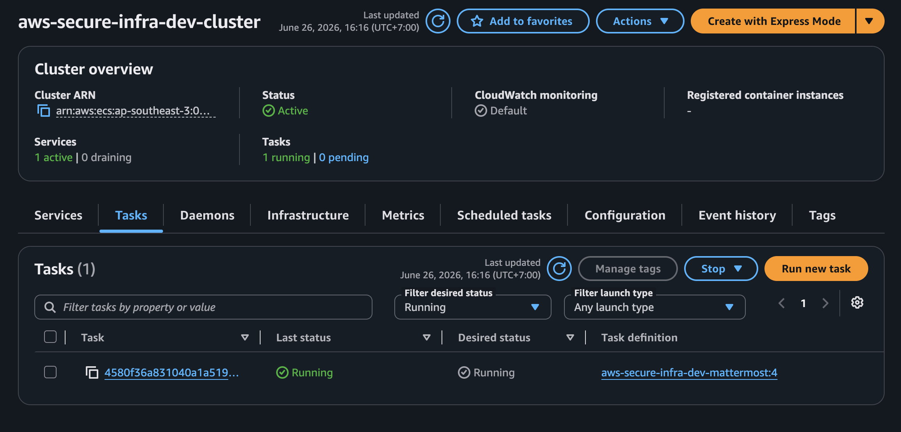
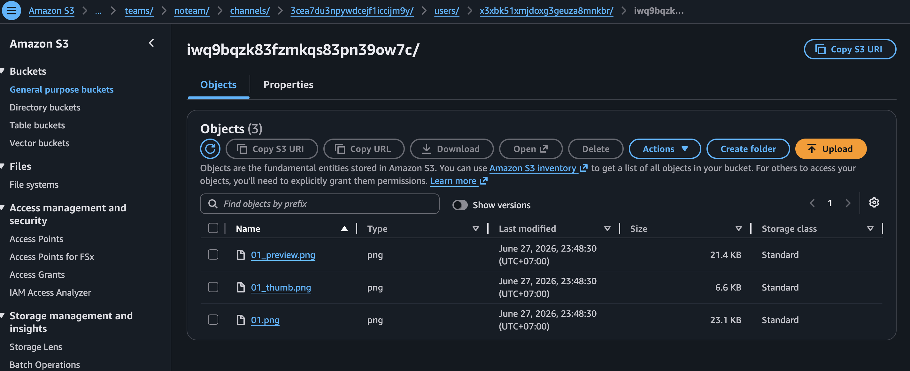
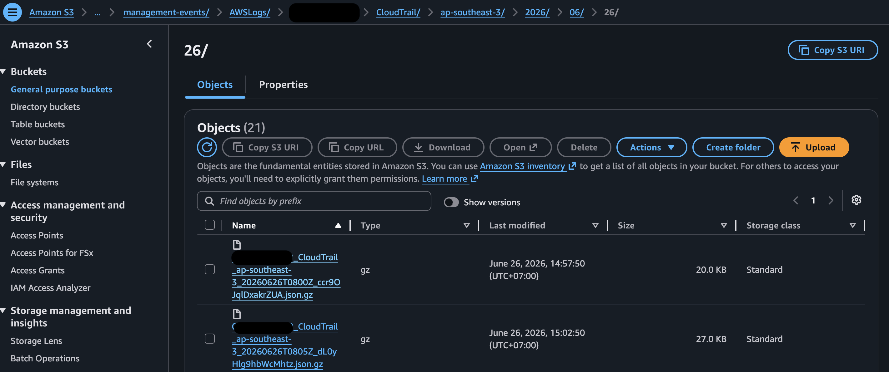
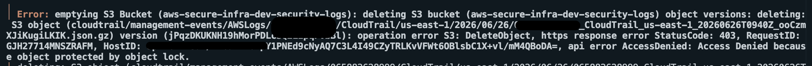
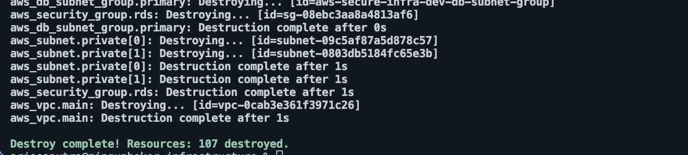

# Phase 1 — Core Infrastructure

**Status:** Completed | `dev` environment | deploy-and-destroy lab model

---

## Scope

Phase 1 establishes the foundational infrastructure required to run Mattermost on AWS with a private-network-only, compute and data tier. The goal is a working, secure-by-default baseline before layering in observability, reliability, and automation in subsequent phases.

### Components delivered

| Component                      | Decision rationale                                                                                                                                          |
| ------------------------------ | ----------------------------------------------------------------------------------------------------------------------------------------------------------- |
| VPC                            | 3-tier subnet design (public/app/data) across 2 AZs; `cidrsubnet()` for deterministic CIDR allocation; no NAT Gateway                                       |
| VPC Endpoints                  | Interface endpoints for ECR, S3, SSM, CloudWatch Logs — private connectivity without internet routing; eliminates ~$32/month NAT Gateway cost               |
| Security Groups                | Least-privilege, cross-referenced rules via standalone rule resources; inline rules were removed to avoid Terraform dependency cycles                       |
| IAM                            | Separate Task Execution Role and Task Role with scoped policies; execution role handles pre-start secret injection, task role handles runtime AWS API calls |
| ECS Fargate                    | Mattermost container in private subnets, no public IP; image pulled from ECR over VPC Endpoint                                                              |
| RDS PostgreSQL (`t3.micro`)    | Private subnet, credentials via SSM, storage encryption with AWS-managed key; free-tier eligible                                                            |
| S3 Bucket (`mattermost-file`)  | Version Enabled, SSE-KMS with CMK, lifecycle tiering to Intelligent Tiering, and noncurrent version expires after 6 month.                                  |
| ALB + ACM                      | TLS termination in public subnets, HTTP→HTTPS redirect, health checks on `/api/v4/system/ping`                                                              |
| Route 53                       | Hosted zone, ALB alias record, ACM validation records                                                                                                       |
| ECR Repository                 | scan-on-push enabled, force delete, mutable image tag                                                                                                       |
| SSM Parameter Store            | DB password stored manually as `SecureString` (free standard tier); DSN constructed in `locals` and injected at container start via `secrets` block         |
| CloudTrail + S3 (`logs`) + KMS | Multi-region management event capture; S3 with COMPLIANCE object lock, SSE-KMS with CMK, lifecycle tiering to IA → Glacier IR → Deep Archive                |

### Explicitly deferred

| Item                                                      | Deferred to                                     | Reason                                                                                                             |
| --------------------------------------------------------- | ----------------------------------------------- | ------------------------------------------------------------------------------------------------------------------ |
| Multi-AZ RDS                                              | Phase 2 — Reliability pillar                    | Doubles RDS cost; no real benefit in a lab environment                                                             |
| Remote Terraform state (S3 backend + DynamoDB lock table) | Phase 3                                         | Low-effort, no downside — but not needed until CI/CD is introduced; identified as a hard blocker for Phase 3       |
| Secrets Manager                                           | Phase 2 — Security pillar (under consideration) | SSM `SecureString` covers Phase 1 requirements; Secrets Manager migration not yet confirmed for Phase 2 scope      |
| Terraform modules                                         | Phase 3                                         | Module boundaries are not yet clear; premature extraction before Phase 2 is complete introduces wrong abstractions |
| WAF                                                       | Open — requires explicit in/out decision        | Introduces an ongoing cost line item; deliberate scoping decision required before Phase 2 begins                   |

---

## Validation

Infrastructure was validated before Phase 1 was marked complete:

- `terraform validate` passes

- `terraform plan` completes with no errors and no unexpected diffs

- `terraform apply` completed

- VPC resource map

- ECS service healthy

- ECS task reaches `RUNNING` state and connects to RDS successfully

- RDS Connect to VPC EndPoint interface

- Mattermost loads over HTTPS

- Uploaded file stored into S3 bucket

- CloudTrail logs delivered to S3 security logs

- S3 bucket object lock compliance mode denied deleting bucket

- `terraform destroy` passes

> The domain is not permanently live. The stack uses a deploy-and-destroy model — it is spun up during active lab sessions and torn down afterward to control cost. The screenshot above is the validation artifact.

---

## Accepted Tradeoffs

| Tradeoff                                 | Accepted because                                                                                                                                                                                                                                                 |
| ---------------------------------------- | ---------------------------------------------------------------------------------------------------------------------------------------------------------------------------------------------------------------------------------------------------------------- |
| Single-AZ RDS                            | Multi-AZ doubles cost with no real benefit in a lab environment. Upgrade scoped to Phase 2 Reliability pillar.                                                                                                                                                   |
| Local Terraform state                    | `.tfstate` stores the DSN in plaintext as a side effect of Terraform managing the SSM parameter. Acceptable for a local-state lab; production requires a remote backend with encryption and scoped access controls. Remote state migration is scoped to Phase 3. |
| SSM Parameter Store over Secrets Manager | `SecureString` is free on the standard tier. See [ADR-002](../decision-records/adr-002-ssm-parameter-store-over-secrets-manager.md).                                                                                                                             |
| DSN constructed and written by Terraform | Avoids runtime complexity in Phase 1. The consequence — DSN ending up in `.tfstate` in plaintext — is documented above and in the [architecture overview](../architecture/overview.md).                                                                          |

---

## Issues Encountered

Real debugging issues hit during Phase 1 — ECS role confusion, URI encoding in the DSN, and Terraform security group dependency cycles — are documented in [Lessons Learned](../lessons-learned/index.md).

---

## Next Phase

[Phase 2 — Operational Exelence Pillar →](../phase-2-well-architected/pillar-1-operational-exelence.md)
